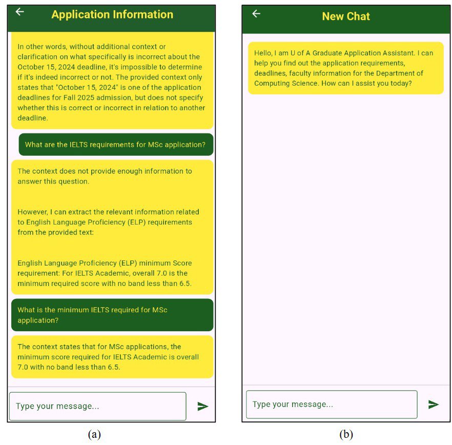
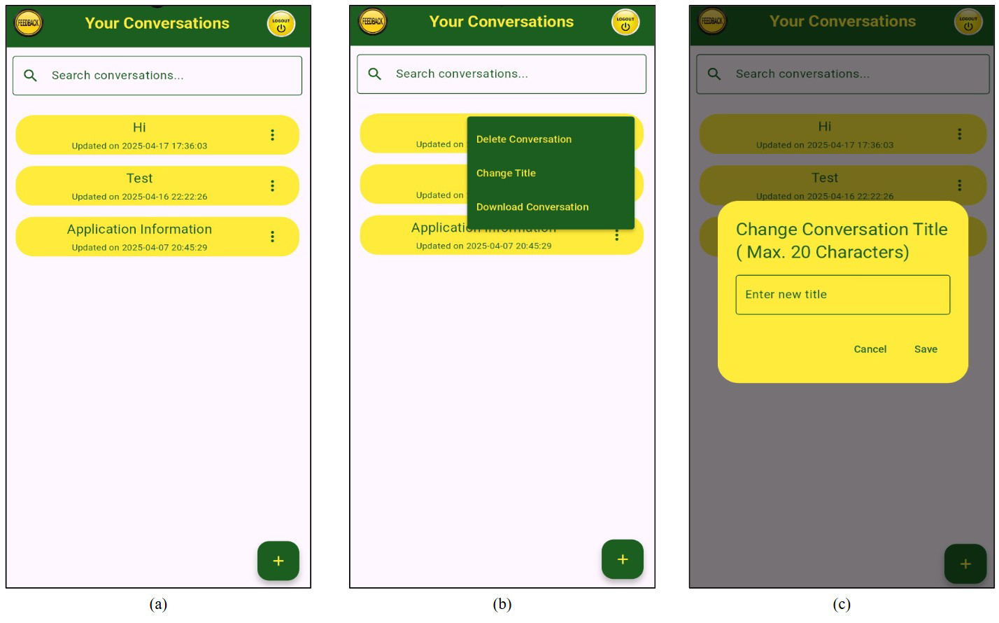
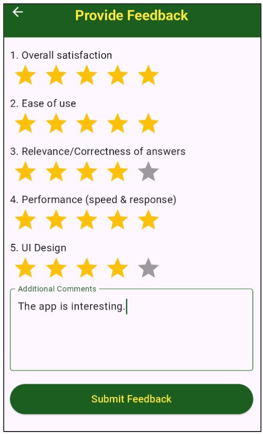
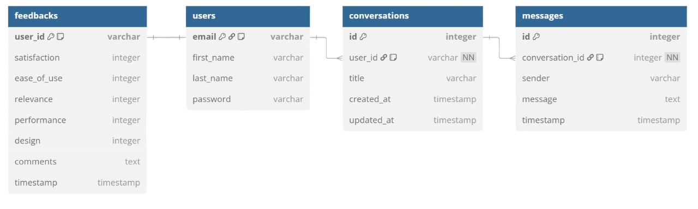

# 🎓 U of A Graduate Application Assistant

An AI-powered full-stack assistant that helps prospective graduate students at the University of Alberta find accurate, up-to-date information about admissions, deadlines, fees, and faculty — powered by **Llama 3.2** and **Retrieval-Augmented Generation (RAG)**.


---

## 🎬 Demo

https://github.com/W786786R/uofa-graduate-assistant/raw/main/docs/uofa.mp4

> 📄 See [`docs/SETUP.md`](docs/SETUP.md) for full setup instructions.

---

## 📖 Overview

Prospective graduate students often struggle to find accurate, timely information about application deadlines, fees, program prerequisites, and faculty research. Official info is scattered across many web pages and PDFs, and support channels (email, help desks) are slow and constrained by office hours.

This project solves that with an AI assistant that:

- Answers domain-specific questions grounded in **verified U of A documents** (web pages + PDFs)
- Reduces LLM hallucinations via **RAG + cross-encoder re-ranking**
- Supports **OTP-based login**, **persistent chat history**, **keyword search**, and **downloadable conversations**
- Runs **entirely on local infrastructure** via Ollama — no external cloud dependency required
- Ships as both an **Android app** and a **web app** from a single Flutter codebase

---

## 🏗️ System Architecture

The pipeline combines four layers:

1. **Dataset Extraction** — Python + BeautifulSoup scraper for U of A web pages → structured PDFs
2. **RAG Pipeline** — ChromaDB vector store → top-10 retrieval → cross-encoder re-ranking → top-5 chunks to LLM
3. **Backend** — FastAPI + SQLite (SQLAlchemy) + Ollama client + OTP email service
4. **Frontend** — Flutter (Android + Web) with Provider state management

| Component | Choice |
|---|---|
| LLM | Llama 3.2 (via Ollama) |
| Embedding model | `all-MiniLM-L6-v2` |
| Re-ranker | `cross-encoder/ms-marco-MiniLM-L-6-v2` |
| Vector DB | ChromaDB (cosine similarity) |
| Chunk size / overlap | 600 / 100 |
| Retrieval | Top-10 → re-rank → Top-5 |

---

## 📱 Screenshots

### Chat Interface



### Conversation Management



### Feedback Collection



### Database Schema



---

## 🚀 Quick Start

### Prerequisites

- Python 3.13.1+
- Flutter SDK 3.29.0+
- [Ollama](https://www.ollama.com/download) with Llama 3.2 pulled
- Android Studio or VS Code with Flutter plugins

### 1. Run Ollama with Llama 3.2

```bash
ollama pull llama3.2
ollama run llama3.2
```

Keep this terminal open. Verify with `ollama ps`.

### 2. Run the Backend

```bash
cd Backend
python -m venv venv

# Windows
venv\Scripts\activate

# macOS/Linux
source venv/bin/activate

pip install -r requirements.txt
uvicorn main:app --host 0.0.0.0 --port 8000 --reload
```

Verify: open [http://127.0.0.1:8000/docs](http://127.0.0.1:8000/docs) in your browser.

### 3. Run the Frontend

```bash
cd Frontend
flutter pub get
flutter devices
flutter run                  # emulator / device
# or
flutter run -d chrome        # web
```

> ⚠️ The backend and Ollama must be running for the frontend to work.

### 4. Environment Variables

Create `Backend/.env` with your own values:

```env
SMTP_SERVER=
SMTP_PORT=
SENDER_EMAIL=
SENDER_PASSWORD=
OLLAMA_HOST=http://localhost:11434
LLM_MODEL=llama3.2
```

> 🔒 `.env` is gitignored — never commit real credentials.

---

## 🧪 Experimental Results

### Chunk Size Optimization

Benchmark of 10 questions across chunk sizes:

| Chunk Size | Response Time (s) | Accuracy (%) |
|---|---|---|
| 300 | 2.8 | 78 |
| 400 | 3.3 | 84 |
| 500 | 3.6 | 87 |
| **600** | **3.9** | **91** ✅ |
| 700 | 4.2 | 88 |
| 800 | 4.7 | 85 |

**Result:** 600-character chunks with 100-character overlap yielded the best accuracy.

### User Feedback

16 participants rated the app across 5 dimensions. Highlights:

- Overall satisfaction: **4.6 / 5**
- Ease of use: **4.7 / 5**
- Relevance / correctness of answers: **4.2 / 5**
- Performance (speed & response): **4.7 / 5**
- UI design: **4.6 / 5**

---

## 🗂️ Project Structure

```
uofa-graduate-assistant/
├── Frontend/               # Flutter app (Android + Web)
├── Backend/                # FastAPI server + SQLite + RAG integration
├── RAG Implementation/     # Standalone RAG pipeline (test/experiment)
├── Dataset Extraction/     # Web scraper
└── docs/                   # Setup guide, dataset info, screenshots, demo video
```

---

## 🛠️ Tech Stack

**Frontend:** Flutter 3.29, Dart 3.7, Provider, `http`, `shared_preferences`, `flutter_rating_bar`

**Backend:** FastAPI, Uvicorn, SQLAlchemy, SQLite, ChromaDB, `aioSMTPLIB`, Ollama Python client

**RAG:** LangChain text splitters, `sentence-transformers`, `PyMuPDF`, Cross-Encoder re-ranker

**Deployment:** Google Cloud Run (Docker), GitHub Pages, AWS GPU instance (Ollama)

---


## 📄 License

Released under the MIT License.

---

